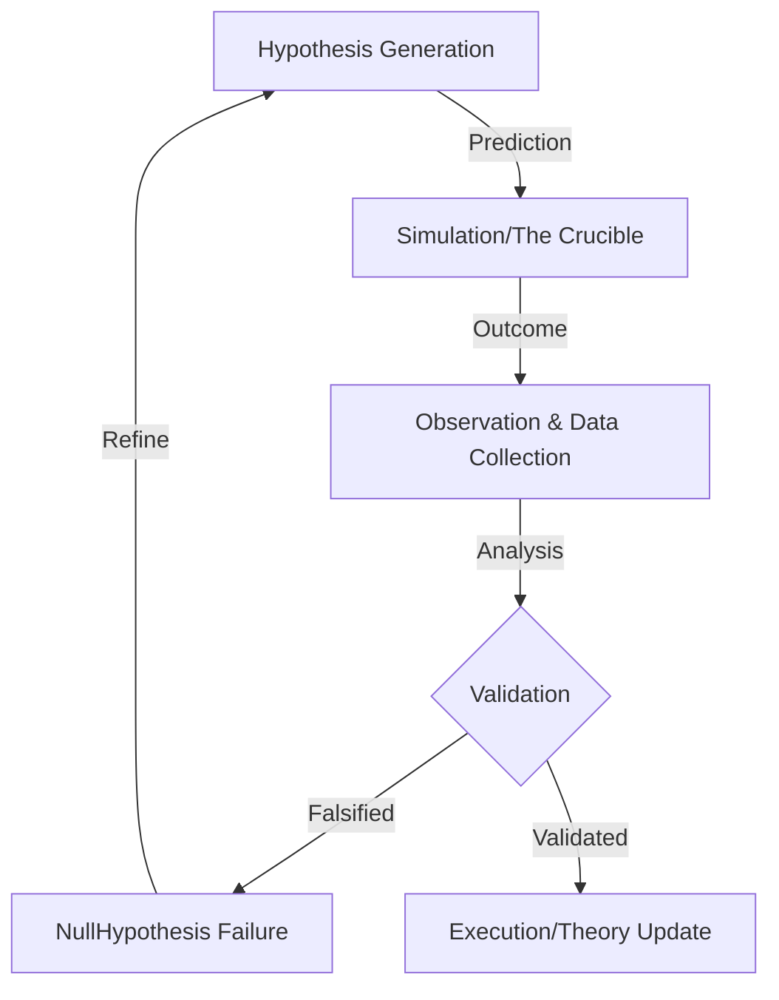

# Fixer's Log: Scientific Method Framework (SMF)
## Solving the "Hallucinating AI" Crisis (Phase 3)

> "A high-profile technical client came to me with a nightmare: their autonomous trading agents were 'lying' to them—hallucinating transaction confirmations and following phantom causal links. Generic safety wrappers weren't seeing the problem because the code was technically valid, just epistemologically broken. They needed more than a debugger; they needed a computational straitjacket."

### The "Why": Computational Constraints for Verifiable Agentic Autonomy
In an era of stochastic parrots, the SMF enforces empirical rigor on agentic reasoning...

## 🏛️ Epistemological Grounding
The SMF functions as a **Logical Constraint Layer** for Large Language Models. In the context of Antigravity or other agentic systems, this isn't just a philosophy—it’s the "safety rail" that prevents hallucinated paths by requiring rigorous, repeatable validation loops. 

By treating every intent as a **Hypothesis** and every execution as an **Experiment**, the system ensures that AI actions are predictive, observable, and—most importantly—falsifiable.

## 🔬 The Logic Flow (The SMF Loop)


## ⚔️ The Crucible Integration
The SMF uses **[The Crucible](file:///c:/Users/sheew/OneDrive/Desktop/the-crucible)** as its primary execution environment. Every `Experiment()` is run within The Crucible's sandboxed harness where adversarial stress-tests and computational constraints are applied. This ensures that a validated hypothesis remains robust even under extreme model-specific pressures.

## 🚀 The "Now": GCP API Validation Example
The following snippet demonstrates an agent using the SMF to validate a critical Google Cloud deployment hypothesis before committing to execution.

```python
from scientific_method.core.scientific_agent import ScientificAgent, KnowledgeBase
from scientific_method.core.foundations import EpistemicVirtue

# Initialize the research environment
kb = KnowledgeBase()
agent = ScientificAgent(domain="Cloud Infrastructure", knowledge_base=kb)

# Define the Hypothesis: Increasing timeout solves the GCP Arbitrage Bot logs error
hyp = agent.hypothesize(
    statement="If I increase the GCP Cloud Run timeout to 300s, the transaction will succeed.",
    virtue=EpistemicVirtue.PREDICTIVE_ACCURACY
)

# Execute via The Crucible (Mock Environment)
experiment = await agent.run_experiment(hyp, environment="the-crucible")

if experiment.null_hypothesis_failed():
    print("Hypothesis Validated: Null hypothesis rejected by The Crucible.")
    agent.apply_theory("Commit GCP Timeout Change")
else:
    print("Hypothesis Falsified: Timeout is not the bottleneck. Analyzing causal gaps.")
```

## 🛠️ Performance Metrics
| Stage | Computational Function | Agent Action |
| :--- | :--- | :--- |
| **Observation** | Data Ingestion | "I see an error in the GCP arbitrage bot logs." |
| **Hypothesis** | Prediction Generation | "If I increase the timeout, the transaction will succeed." |
| **Experiment** | Sandboxed Execution | The Crucible runs the code in a mock environment. |
| **Validation** | Result Comparison | Compare result vs. prediction. Update weights. |

---
docs: formalize computational constraints and framework architecture
*Developed for WADELABS AI Safety Research 2026*
