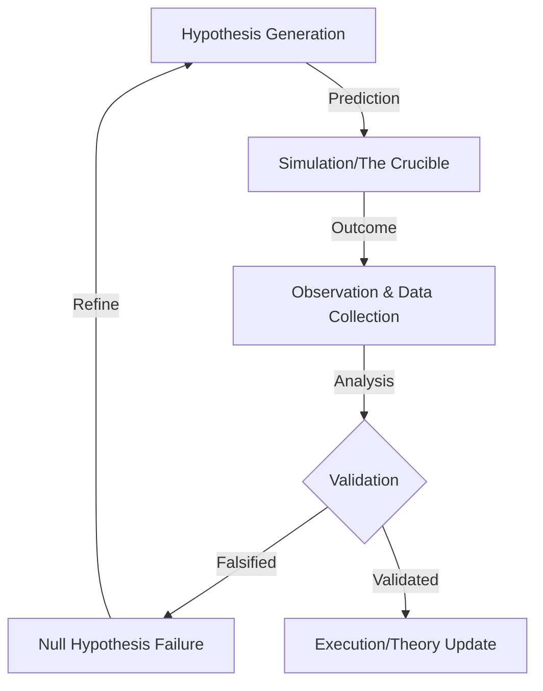

# Scientific Method Framework (SMF)

> **Motivation**: Autonomous AI agents need rigorous validation before execution. The SMF enforces empirical rigor by treating every intent as a hypothesis that must be validated through experimentation before deployment.

[](https://github.com/WADELABS/scientific-method-framework/actions)
[](docs/)
[](api/)
[](docker-compose.yml)

## Overview

The Scientific Method Framework provides a **production-ready** computational implementation of the scientific method for AI agent validation. By requiring testable predictions and experimental validation, it prevents hallucinated paths and ensures verifiable autonomous reasoning.

### 🆕 New in Version 1.0.0

- **REST API**: Full FastAPI implementation for hypothesis management and experiment execution
- **Negative Space Explorer**: AI-driven exploration of unexplored hypothesis space
- **Docker Deployment**: Production-ready containerized deployment
- **Comprehensive Documentation**: 6 detailed guides covering architecture, workflow, and integration
- **Integration Tests**: 22+ tests covering complete workflows
- **Build Infrastructure**: Makefile, pyproject.toml, and mkdocs for modern development

### The SMF Loop

**Hypothesis** → **Experiment** → **Validation** → **Theory Update**

1. **Hypothesis Generation**: Create testable predictions about system behavior
2. **Experiment Execution**: Run tests in sandboxed environment (The Crucible)
3. **Validation**: Compare results against predictions with statistical rigor
4. **Theory Update**: Update knowledge base with validated findings



## Quick Start

### Option 1: Docker (Recommended)

```bash
# Start all services (API, Worker, Docs)
make docker-up

# API available at http://localhost:8000
# Swagger docs at http://localhost:8000/docs
# Documentation site at http://localhost:8080
```

### Option 2: Local Installation

```bash
# Install dependencies
make install

# Run API server
make api

# Or run the simple example
python examples/simple_example.py
```

### Option 3: Development Environment

```bash
# Start development environment with hot reload
make docker-dev
```

This demonstrates a complete SMF cycle:
- Creating a hypothesis about system performance
- Designing and executing an experiment
- Validating results against predictions
- Updating theory based on evidence

## Usage Example

```python
from core.scientific_agent import KnowledgeBase, Hypothesis, ScientificAgent
from datetime import datetime

# 1. Create hypothesis
kb = KnowledgeBase()
hypothesis = Hypothesis(
    id="h_timeout_fix",
    statement="Increasing timeout to 300s will reduce transaction failures",
    variables={"timeout": "300s", "failure_rate": "low"},
    relationships=["timeout_affects_success"],
    domain="system_performance",
    timestamp=datetime.now(),
    confidence=0.7,
    complexity=0.3,
    novelty=0.5,
    testability=0.9
)
kb.add_hypothesis(hypothesis)

# 2. Initialize agent
agent = ScientificAgent(domain="System Performance", knowledge_base=kb)

# 3. Design and run experiment
experiment = create_simple_experiment(hypothesis)
results = run_stub_crucible(experiment)

# 4. Validate and update theory
if results["success_rate"] > 0.8:
    hypothesis.status = HypothesisStatus.SUPPORTED
    print(f"✓ Hypothesis validated: {hypothesis.statement}")
else:
    hypothesis.status = HypothesisStatus.REFUTED
    print(f"✗ Hypothesis refuted - further investigation needed")
```

## Architecture

### Core Components

- **Knowledge Base**: Stores hypotheses, experiments, evidence, and theories
- **Scientific Agent**: Manages the research cycle and hypothesis testing
- **Negative Space Explorer**: Maps unexplored hypothesis space and generates frontier hypotheses
- **REST API**: FastAPI-based HTTP interface for all SMF operations
- **VSA (Verifiable Scientific Autonomy)**: Provides formal logic, citations, and provenance tracking
  - `FormalLogicEngine`: Validates logical inference and consistency
  - `CitationEngine`: Manages provenance and citation formatting
  - `MerkleLedger`: Provides cryptographic provenance chain

### Documentation

Comprehensive documentation is available in the `/docs` directory:

- **[Architecture Guide](docs/ARCHITECTURE.md)**: Framework architecture and Negative Space relationship
- **[Workflow Guide](docs/WORKFLOW.md)**: End-to-end workflow with Merkle Ledger integration
- **[Negative Space](docs/NEGATIVE_SPACE.md)**: Understanding the unexplored hypothesis space
- **[VSA Engines](docs/VSA_ENGINES.md)**: FormalLogic, Citation, and MerkleLedger documentation
- **[API Schemas](docs/API_SCHEMAS.md)**: JSON schemas and API contracts
- **[Integration Guide](docs/INTEGRATION.md)**: Installation and integration patterns

### The Crucible

Experiments are executed in a sandboxed environment called "The Crucible" that provides:
- Isolated execution context
- Measurement and observation capabilities
- Statistical analysis of results
- Adversarial stress testing

## Testing

Run the complete test suite:
```bash
# Unit tests only
make test

# Integration tests
make test-integration

# All tests with coverage
make test-all
```

**Test Coverage:**
- Unit tests: 25 tests passing
- Integration tests: 22 tests passing (workflow + API)
- Total coverage: 86% for core modules

## CI/CD

The project uses GitHub Actions for continuous integration:
- Tests run on Python 3.9, 3.10, 3.11, and 3.12
- Automated linting with flake8
- Code coverage reporting

## Performance Metrics

| Stage | Computational Function | Agent Action |
| :--- | :--- | :--- |
| **Observation** | Data Ingestion | Identify problem or opportunity |
| **Hypothesis** | Prediction Generation | Generate testable prediction |
| **Experiment** | Sandboxed Execution | Run controlled test in The Crucible |
| **Validation** | Result Comparison | Compare results vs. predictions |
| **Theory Update** | Knowledge Integration | Update knowledge base with findings |

## Development

### Project Structure
```
scientific-method-framework/
├── core/                     # Core framework implementation
│   ├── scientific_agent.py   # Base scientific agent
│   ├── negative_space.py     # Negative space explorer
│   ├── foundations.py        # Scientific paradigms
│   └── vsa/                  # Verifiable Scientific Autonomy modules
│       ├── logic/            # Formal logic engine
│       ├── reporting/        # Citation and publishing
│       └── provenance/       # Merkle ledger
├── api/                      # REST API
│   ├── main.py              # FastAPI application
│   └── requirements.txt     # API dependencies
├── docs/                     # Comprehensive documentation
│   ├── ARCHITECTURE.md      # System architecture
│   ├── WORKFLOW.md          # Complete workflow guide
│   ├── NEGATIVE_SPACE.md    # Negative space concept
│   ├── VSA_ENGINES.md       # Engine documentation
│   ├── API_SCHEMAS.md       # API reference
│   └── INTEGRATION.md       # Integration guide
├── tests/                    # Test suite
│   ├── test_*.py            # Unit tests (25 tests)
│   └── integration/         # Integration tests (22 tests)
├── examples/                 # Example implementations
├── Dockerfile               # Production Docker image
├── docker-compose.yml       # Multi-service orchestration
├── Makefile                 # Build commands
├── mkdocs.yml              # Documentation site config
├── pyproject.toml          # Modern Python packaging
└── .github/workflows/       # CI/CD configuration
```

## REST API

The framework provides a production-ready REST API:

```bash
# Start the API
make api

# Or with Docker
make docker-up
```

**API Endpoints:**

- `POST /api/v1/hypotheses` - Create a hypothesis
- `GET /api/v1/hypotheses/{id}` - Get hypothesis details
- `GET /api/v1/hypotheses` - List all hypotheses
- `POST /api/v1/experiments` - Submit an experiment
- `GET /api/v1/experiments/{id}/results` - Get experiment results
- `GET /api/v1/ledger/blocks/{id}` - Get ledger block
- `POST /api/v1/ledger/verify` - Verify ledger integrity
- `GET /api/v1/negative-space/map` - Map negative space
- `POST /api/v1/negative-space/generate` - Generate frontier hypotheses

**Interactive API Documentation:**
- Swagger UI: http://localhost:8000/docs
- ReDoc: http://localhost:8000/redoc

Example usage:
```bash
# Create a hypothesis
curl -X POST http://localhost:8000/api/v1/hypotheses \
  -H "Content-Type: application/json" \
  -d '{
    "statement": "Increasing timeout reduces failures",
    "variables": {"timeout": "300s"},
    "relationships": ["affects"],
    "domain": "performance",
    "confidence": 0.7,
    "complexity": 0.3,
    "novelty": 0.5,
    "testability": 0.9
  }'
```

## Makefile Commands

The project includes a comprehensive Makefile:

```bash
make help               # Show all available commands
make install            # Install dependencies
make test               # Run unit tests
make test-integration   # Run integration tests
make test-all           # Run all tests
make docker-build       # Build Docker image
make docker-up          # Start Docker Compose
make docker-down        # Stop Docker Compose
make docker-dev         # Start development environment
make docs               # Serve documentation locally
make api                # Run API server locally
make lint               # Run code linters
make clean              # Clean build artifacts
```

### Contributing

1. Fork the repository
2. Create a feature branch
3. Add tests for new functionality
4. Ensure all tests pass: `make test-all`
5. Ensure linting passes: `make lint`
6. Submit a pull request

---

*Developed for WADELABS AI Safety Research 2026*
