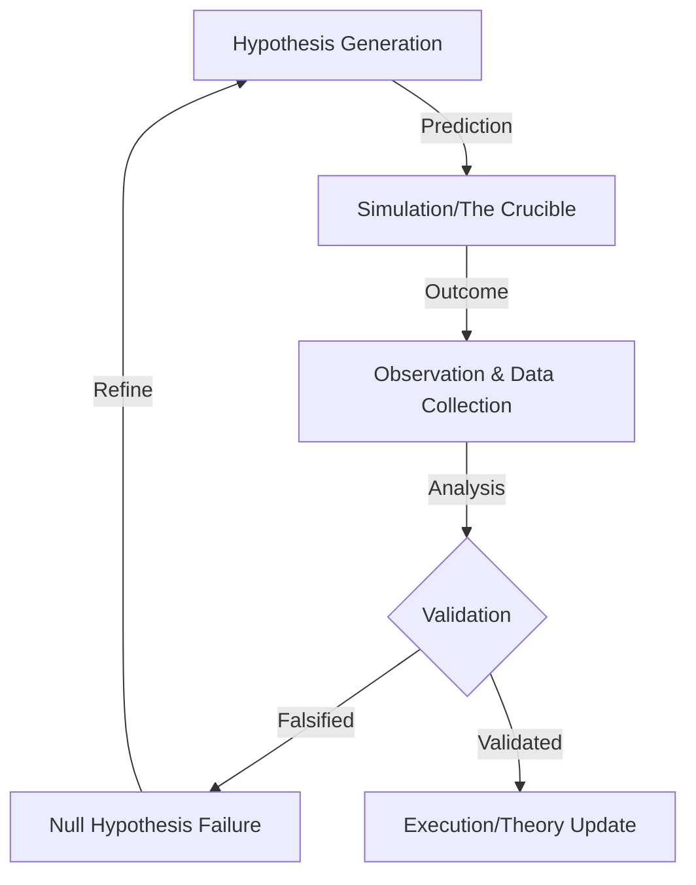

# Scientific Method Framework (SMF)

> **Motivation**: Autonomous AI agents need rigorous validation before execution. The SMF enforces empirical rigor by treating every intent as a hypothesis that must be validated through experimentation before deployment.

## Overview

The Scientific Method Framework provides a computational implementation of the scientific method for AI agent validation. By requiring testable predictions and experimental validation, it prevents hallucinated paths and ensures verifiable autonomous reasoning.

### The SMF Loop

**Hypothesis** → **Experiment** → **Validation** → **Theory Update**

1. **Hypothesis Generation**: Create testable predictions about system behavior
2. **Experiment Execution**: Run tests in sandboxed environment (The Crucible)
3. **Validation**: Compare results against predictions with statistical rigor
4. **Theory Update**: Update knowledge base with validated findings



## Quick Start

Install dependencies:
```bash
pip install -r requirements.txt
```

Run the simple example:
```bash
python examples/simple_example.py
```

This demonstrates a complete SMF cycle:
- Creating a hypothesis about system performance
- Designing and executing an experiment
- Validating results against predictions
- Updating theory based on evidence

## Usage Example

```python
from core.scientific_agent import KnowledgeBase, Hypothesis, ScientificAgent
from datetime import datetime

# 1. Create hypothesis
kb = KnowledgeBase()
hypothesis = Hypothesis(
    id="h_timeout_fix",
    statement="Increasing timeout to 300s will reduce transaction failures",
    variables={"timeout": "300s", "failure_rate": "low"},
    relationships=["timeout_affects_success"],
    domain="system_performance",
    timestamp=datetime.now(),
    confidence=0.7,
    complexity=0.3,
    novelty=0.5,
    testability=0.9
)
kb.add_hypothesis(hypothesis)

# 2. Initialize agent
agent = ScientificAgent(domain="System Performance", knowledge_base=kb)

# 3. Design and run experiment
experiment = create_simple_experiment(hypothesis)
results = run_stub_crucible(experiment)

# 4. Validate and update theory
if results["success_rate"] > 0.8:
    hypothesis.status = HypothesisStatus.SUPPORTED
    print(f"✓ Hypothesis validated: {hypothesis.statement}")
else:
    hypothesis.status = HypothesisStatus.REFUTED
    print(f"✗ Hypothesis refuted - further investigation needed")
```

## Architecture

### Core Components

- **Knowledge Base**: Stores hypotheses, experiments, evidence, and theories
- **Scientific Agent**: Manages the research cycle and hypothesis testing
- **VSA (Verifiable Scientific Autonomy)**: Provides formal logic, citations, and provenance tracking
  - `FormalLogicEngine`: Validates logical inference and consistency
  - `CitationEngine`: Manages provenance and citation formatting
  - `MerkleLedger`: Provides cryptographic provenance chain

### The Crucible

Experiments are executed in a sandboxed environment called "The Crucible" that provides:
- Isolated execution context
- Measurement and observation capabilities
- Statistical analysis of results
- Adversarial stress testing

## Testing

Run the test suite:
```bash
pytest tests/ -v --cov=core --cov=src
```

Current test coverage: 86% for core scientific agent module

## CI/CD

The project uses GitHub Actions for continuous integration:
- Tests run on Python 3.9, 3.10, 3.11, and 3.12
- Automated linting with flake8
- Code coverage reporting

## Performance Metrics

| Stage | Computational Function | Agent Action |
| :--- | :--- | :--- |
| **Observation** | Data Ingestion | Identify problem or opportunity |
| **Hypothesis** | Prediction Generation | Generate testable prediction |
| **Experiment** | Sandboxed Execution | Run controlled test in The Crucible |
| **Validation** | Result Comparison | Compare results vs. predictions |
| **Theory Update** | Knowledge Integration | Update knowledge base with findings |

## Development

### Project Structure
```
scientific-method-framework/
├── core/                  # Core framework implementation
│   ├── scientific_agent.py
│   ├── foundations.py
│   └── vsa/              # Verifiable Scientific Autonomy modules
│       ├── logic/        # Formal logic engine
│       ├── reporting/    # Citation and publishing
│       └── ledger/       # Cryptographic provenance
├── src/                  # Re-exports and integrations
├── examples/             # Example implementations
│   └── simple_example.py # Quick start demonstration
├── tests/                # Test suite
└── .github/workflows/    # CI/CD configuration
```

### Contributing

1. Fork the repository
2. Create a feature branch
3. Add tests for new functionality
4. Ensure all tests pass: `pytest tests/`
5. Ensure linting passes: `flake8 core/ src/ --max-line-length=120`
6. Submit a pull request

---

*Developed for WADELABS AI Safety Research 2026*
